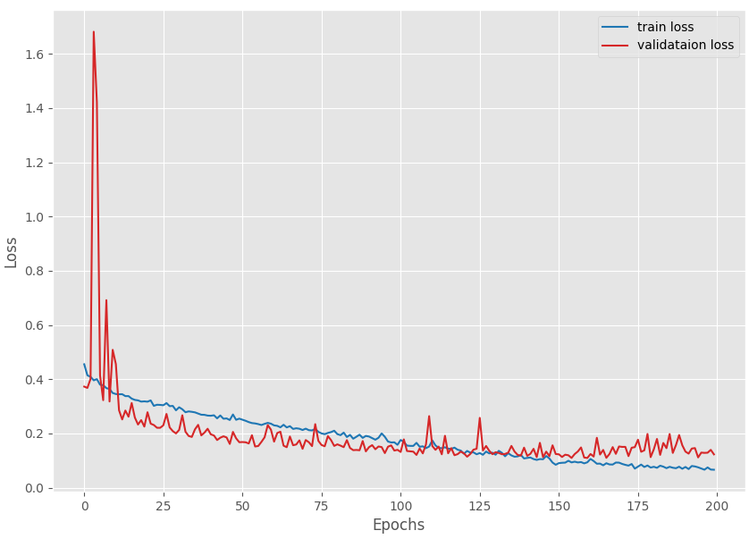

## Image Segmentation
Image segmentation is a computer vision task that segments an image into multiple areas by assigning a label to every pixel of the image. It provides much more information about an image than object detection, which draws a bounding box around the detected object, or image classification, which assigns a label to the object.

Segmentation is useful and can be used in real-world applications such as medical imaging, clothes segmentation, flooding maps, self-driving cars, etc. 

U-Net is a semantic segmentation technique originally proposed for medical imaging segmentation. It’s one of the earlier deep learning segmentation models, and the U-Net architecture is also used in many GAN variants such as the Pix2Pix generator. 

U-Net was introduced in the paper, [U-Net: Convolutional Networks for Biomedical Image Segmentation](https://arxiv.org/abs/1505.04597). The model architecture is simple: an encoder for downsampling and a decoder for upsampling with skip connections. As **Figure 1** shows, it shapes like the letter U hence the name U-Net.

{ width="600" height="400" align="center" }
*Figure 1. Unet Model Architectre*
## Dataset
We are using 2 datasets for training this model. One is Penn-Fudan Pedestrain dataset and Berkeley Segmentation Dataset 500 (BSDS500). 

1. The Penn-Fudan Pedestrian dataset contains images for pedestrian detection and segmentation. It has a total of 170 images and 345 labeled persons.

The original dataset can be found on the official [Penn-Fudan Database](https://www.kaggle.com/datasets/sovitrath/penn-fudan-pedestrian-dataset-for-segmentation) for Pedestrian Detection and Segmentation website.

But we do not need the bounding box information for this project. So, I prepared a different version of the Penn-Fudan dataset only for semantic segmentation with proper training/validation split. 

2. BSDS500: The [BSDS](https://www.kaggle.com/datasets/balraj98/berkeley-segmentation-dataset-500-bsds500) dataset consists of 500 natural images, ground-truth human annotations and benchmarking code. The data is explicitly separated into disjoint train, validation and test subsets. The dataset is an extension of the BSDS300, where the original 300 images are used for training / validation and 200 fresh images, together with human annotations, are added for testing. Each image was segmented by five different subjects on average. 

### The Penn-Fudan Pedestrian Segmentation Masks ###
The segmentation masks in the Penn-Fudan Pedestrian dataset are grayscale images. In each mask, the background has a pixel value of 0. While each person is indicated by an incrementing pixel value. This means if there are two persons, the instance of the first person has a pixel value of 1 and the second person has a pixel value of 2.

But while writing the dataset preparation code, we will replace all pixels other than 0 with 255. This will make the mask of each person entirely white and the rest of the code will also become simpler.

*Figure 2. Penn-Fudan Pedestrian images and masks.*

### Training UNet from Scratch Project Directory Structure ###
**Directory Structure Tree**

*Figure 3. Project directory structure*

### Analyzing the Graphs ###
The following are the loss, accuracy, and mean IoU graphs.

*Figure 4. Accuracy graphs after training on the Penn-Fudan dataset.*

*Figure 5. Mean IoU graphs after training on the Penn-Fudan Pedestrian segmentation dataset.*

*Figure 6. Loss graphs after training the UNet model from scratch*

Here we can observe that the plots for the validation accuracy and mean IoU also follow a similar trend. They both almost keep on improving till the end.

### Inference using the Trained UNet Model ##
We can run inference on images in a directory using the inference_image.py script. All the results will be saved inside the outputs/inference_results directory.

Here are a few results where the model performed well, if not the best.

*Figure 7. Good inference results after training the UNet model using PyTorch on the Penn-Fudan Pedestrian segmentation dataset.*

We can see that the model performs well but not very well obviously. In some cases, it is able to differentiate between a person and a handbag, while in some other cases, it isn’t. For sure, there is scope for improvement.

It looks like, the model may need even more training with data augmentation and then it will be able to perform well. Also, we had only 146 samples for training. Having more training instances will surely help the model.

**THANKS YOU!!**